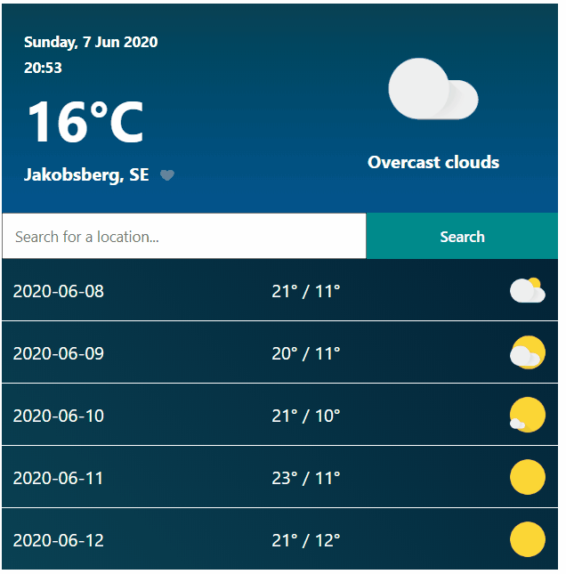

## Weather Application (React)

**Creation date: 2019-09-28**

This weather application shows you the current weather conditions or a five day forecast, based on either your current location or on a search query. It's also possible to add favorites. The application uses the Weatherbit API.

The project was bootstrapped with [Create React App](https://github.com/facebook/create-react-app) and its main components are built with React Hooks.

At startup, run the following command to include the necessary dependencies:
### `npm install`

Then run the following command to start the application:
### `npm start`

Here is a preview of what the application looks like:

